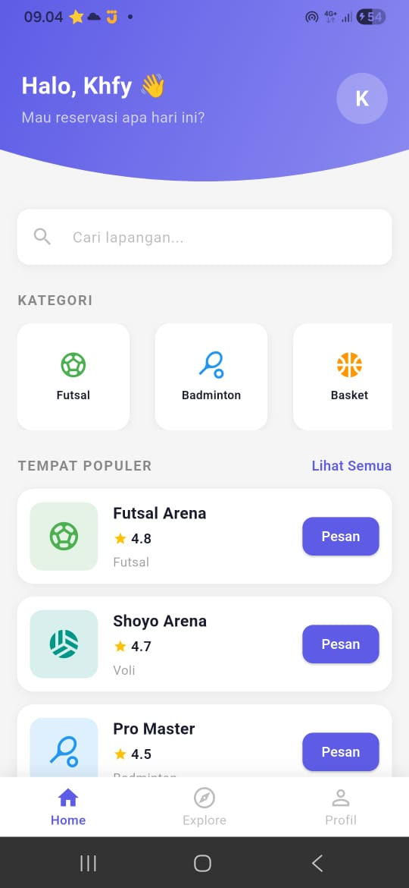

# BookingGo Users App

## Deskripsi
BookingGo Users adalah aplikasi mobile berbasis Flutter yang digunakan untuk melakukan reservasi lapangan olahraga secara online. Aplikasi ini terhubung dengan sistem admin (BookingGo Admin) melalui Firebase untuk sinkronisasi data secara real-time.

## Fitur
- Login & Register pengguna
- Melihat daftar lapangan
- Pencarian lapangan
- Booking lapangan
- Memilih jadwal bermain
- Pembayaran (simulasi)
- Riwayat booking
- Profil pengguna

## Teknologi yang Digunakan
- Flutter (Mobile Framework)
- Firebase Authentication (Login & Register)
- Firebase Firestore (Database)
- Firebase (integrasi dengan admin system)

## Gambaran Sistem
Aplikasi ini terhubung dengan BookingGo Admin Dashboard, di mana data booking dari pengguna akan langsung masuk ke sistem admin untuk dikelola.


## Cara Menjalankan Project
1. Clone repository
2. Jalankan `flutter pub get`
3. Konfigurasi Firebase (google-services.json)
4. Jalankan aplikasi:
   ```bash
   flutter run
